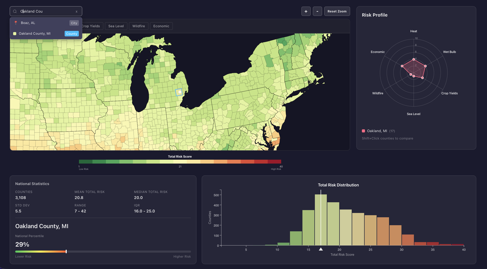

# U.S. Climate Risk Explorer

**Live:** [us-climate-risk.vercel.app](https://us-climate-risk.vercel.app)

Interactive visualization of U.S. county-level climate risk projections for 2040–2060, based on data from [ProPublica / Rhodium Group](https://projects.propublica.org/climate-migration/).



## Risk Factors

Heat, Wet Bulb, Crop Yields, Sea Level Rise, Wildfire, Economic Damage

## Tech Stack

React, Vite, D3.js

## Running Locally

```sh
bun install
bun run dev
```

## License

MIT
